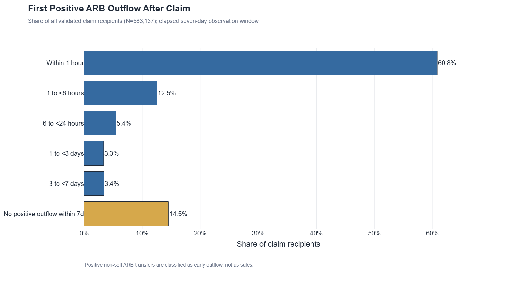
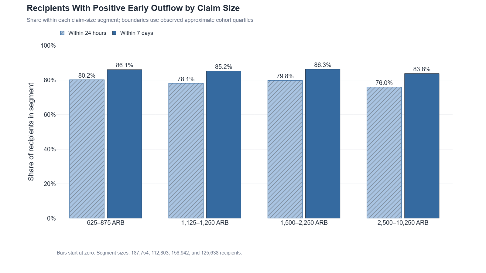
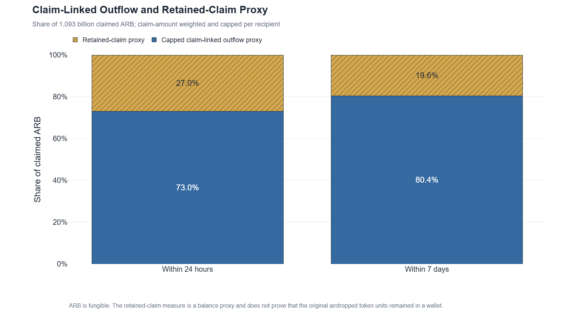
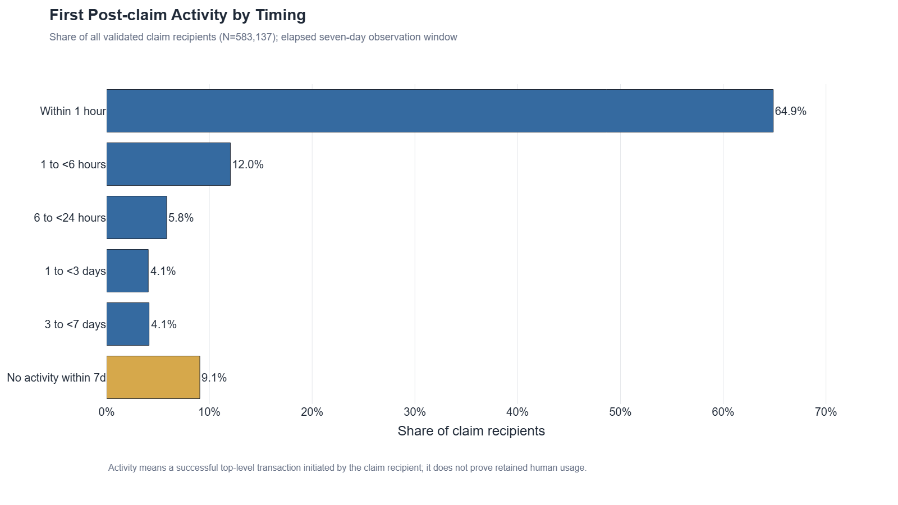
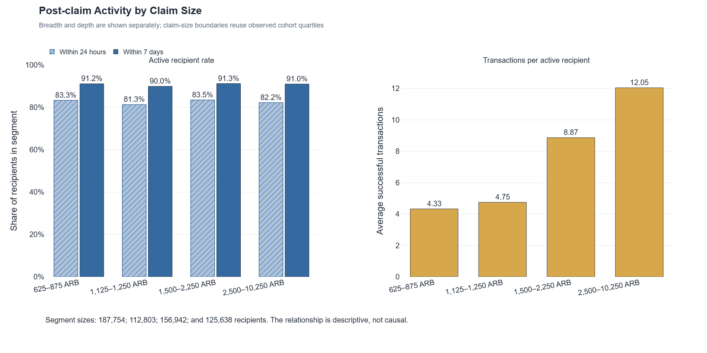
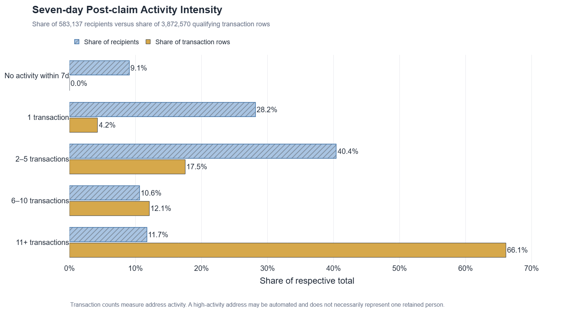
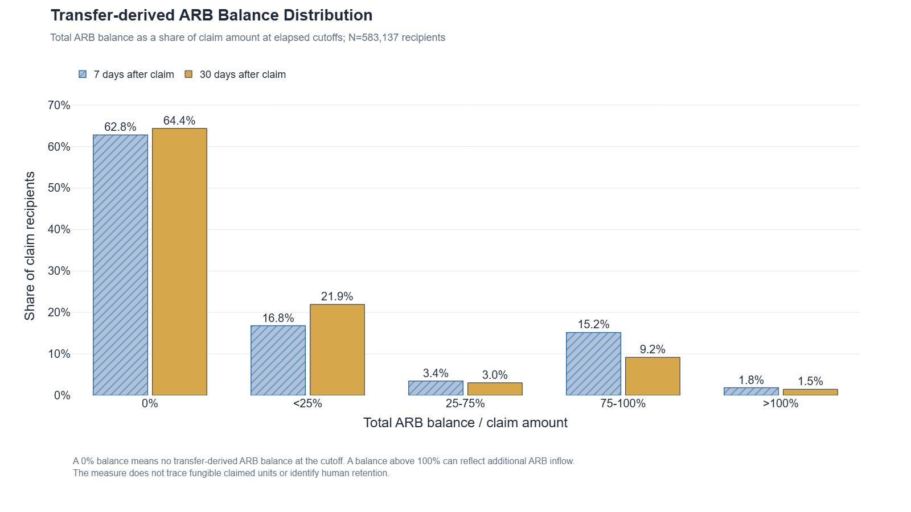
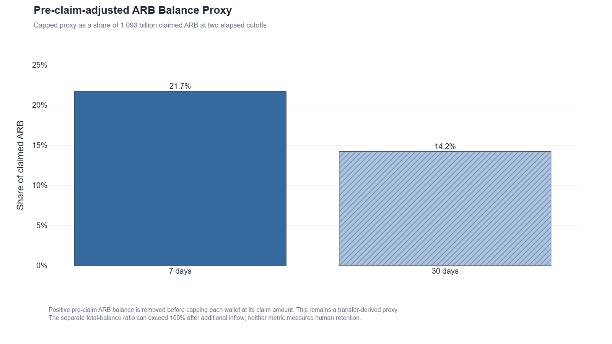

# ARB Airdrop: Early Outflow, Address Activity and Transfer-Derived Balance Proxies

An open, reproducible onchain analysis of the quality of the ARB airdrop.

By [Nikita Onchain](https://github.com/NikitaOnchain).

The project examines whether different groups of claimers retained ARB and remained active on Arbitrum after claiming. It combines documented SQL, data-quality checks, reproducible charts, methodology, limitations, and decision-oriented findings.

## Current status

The analytical v1 is complete. The validated cohort contains 583,137 unique claim recipients and exactly 1,092,811,500 claimed ARB. The full-cohort early-outflow and post-claim address-activity baselines passed their documented structural, cross-layer, bounded-subset, aggregate, and deterministic wallet-sample checks. The 7-day and 30-day `transfer-derived ARB balance proxy` also passed aggregate QA and deterministic signed-leg recomputation.

## Full technical report

- [Open the self-contained HTML report](reports/arb_airdrop_report.html)
- [Inspect the canonical report artifact](reports/arb_airdrop_report_artifact.json)
- [Rebuild the report artifact](reports/build_portfolio_report.py)

## Early-outflow findings

- 459,437 recipients (78.8%) had at least one positive non-self ARB outflow within 24 elapsed hours; 498,511 (85.5%) did so within seven days.
- 354,666 recipients (60.8%) had their first positive outflow within one hour. 84,626 (14.5%) had no qualifying positive outflow in the first seven days.
- The capped claim-linked outflow proxy reached 73.0% of claimed ARB within 24 hours and 80.4% within seven days. The complementary retained-claim proxies were 27.0% and 19.6%.

These are transfer-based early-outflow measures, not sales measures. The capped amount is a fungibility-aware proxy rather than proof that specific airdropped token units moved or remained.

## Post-claim activity findings

- 482,559 recipients (82.8%) initiated at least one successful top-level Arbitrum transaction within 24 elapsed hours; 530,248 (90.9%) did so within seven days.
- 378,291 recipients (64.9%) first became active within one hour. 52,889 (9.1%) had no qualifying activity in the first seven days.
- Seven-day active-recipient rates were similar across claim-size segments (90.0% to 91.3%), while average transactions per active recipient increased from 4.33 in the lowest segment to 12.05 in the highest.
- The 68,422 recipients with 11 or more qualifying transactions represented 11.7% of recipients but generated 66.1% of all qualifying seven-day transaction rows.

Activity means successful top-level transactions initiated by the claiming address after exact claim order. It is not proof of retained human usage, protocol engagement, token retention, or sales.

## Transfer-derived ARB balance proxy findings

The distribution below compares each recipient's transfer-derived total ARB balance with that recipient's validated claim amount.

| Total ARB balance / claim amount | 7 days after claim | 30 days after claim |
|---|---:|---:|
| 0% | 365,994 (62.8%) | 375,348 (64.4%) |
| <25% | 97,883 (16.8%) | 127,912 (21.9%) |
| 25–75% | 20,104 (3.4%) | 17,726 (3.0%) |
| 75–100% | 88,386 (15.2%) | 53,530 (9.2%) |
| >100% | 10,770 (1.8%) | 8,621 (1.5%) |

- The capped, pre-claim-adjusted retained-claim proxy represented 237.176 million ARB (21.7% of claimed ARB) at seven days and 155.286 million ARB (14.2%) at 30 days.
- 4,710 recipients had a positive transfer-derived ARB balance before claiming. The adjusted proxy removes this positive pre-claim balance before capping each recipient's value between zero and the claim amount.
- A total-balance ratio above 100% can reflect additional ARB received after the claim. It is not a retention rate above 100%.

These are transfer-derived balance proxies, not historical balance snapshots or fungible-token attribution. Token balance, address activity, protocol engagement, and human retention are separate concepts; this section measures only the documented balance proxies.

## Figures

















## Portfolio case v1 scope

- Validated ARB claim cohort and claimed amount
- 24-hour and 7-day early outflow
- Validated 24-hour and 7-day post-claim address activity
- Validated 7-day and 30-day `transfer-derived ARB balance proxy`
- Descriptive claim-size and timing segments, deterministic samples, and explicit limitations

An outgoing ARB transfer is not automatically classified as a sale. Until a DEX swap or a transfer to a reliably labeled exchange address is demonstrated, the analysis uses the term **early outflow**.

## Reproducibility standard

Each analytical query must document its output grain, source tables, join keys, filters, and row-multiplication risks. Results are not considered ready until duplicate and `NULL` checks, manual wallet-level inspection, and an independent aggregate cross-check have been completed.

The report builder pins the reviewed analytical inputs by SHA-256, and the [offline validator](scripts/validate_public_v1_report.py) checks the report, figures, notebooks, local links, input hashes, and privacy-sensitive patterns without network access. Private BigQuery project and dataset identifiers are replaced with the neutral placeholders `YOUR_PROJECT_ID` and `YOUR_DATASET_ID`; readers should substitute their own local values before running SQL that materializes working tables.

The balance-proxy figures are generated by the [reproducible notebook](notebooks/retention_arb_balance_proxy_charts.ipynb) under the [documented chart contract](reports/retention_arb_balance_proxy_chart_contract.md).

## Repository structure

```text
.
|-- sql/          # Versioned analytical queries and validation checks
|-- notebooks/    # Reproducible exploration and chart generation
|-- data/         # Small, shareable derived datasets or samples
|-- figures/      # Publication-ready charts
|-- reports/      # Methodology and final written analysis
`-- scripts/      # Offline validation and report packaging helpers
```

## Intended stack

BigQuery Sandbox, Google Blockchain Analytics, GitHub, and Python/Plotly.
